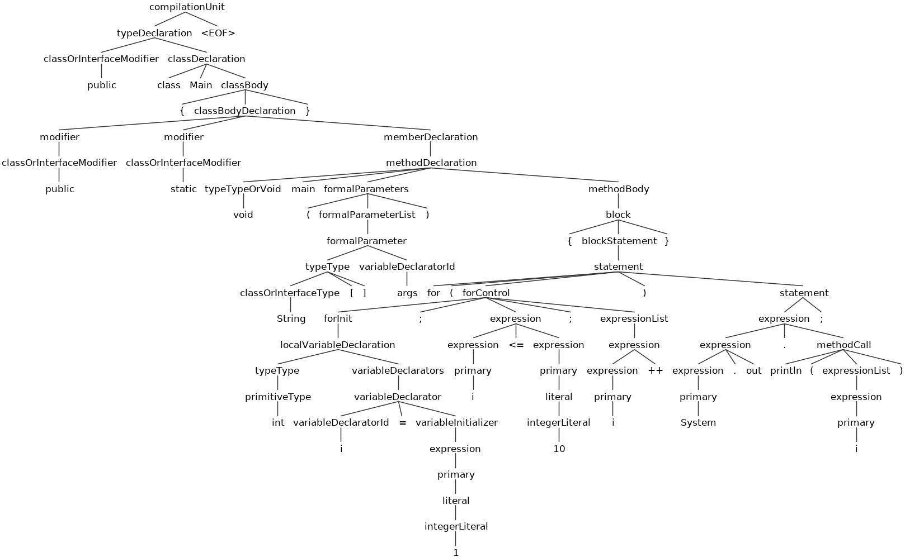

# ANTLRv4-With-JAVA

## How to use:-

```
python3 traverse.py <file_path>
```

## Example:-

```
 python3 traverse.py correct_sample.java 
```

There would be no output in this case as correct_sample.java is consistent with the grammar rules.

## The graphical representation of the AST of correct_sample.java,




## Example:-

```
 python3 traverse.py incorrect_sample.java 
```

## Output:-

```
line 5:4 no viable alternative at input 'random_text\n    }'
```
